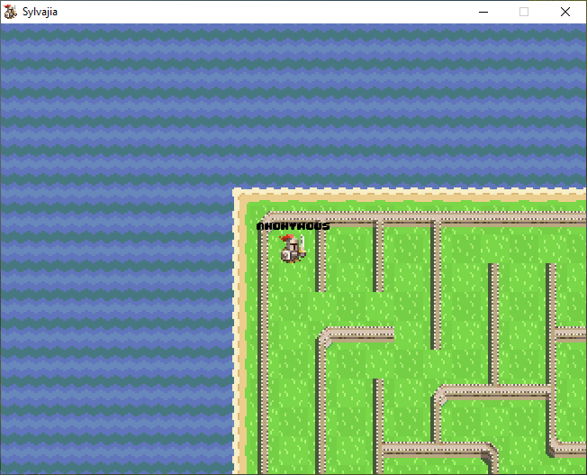
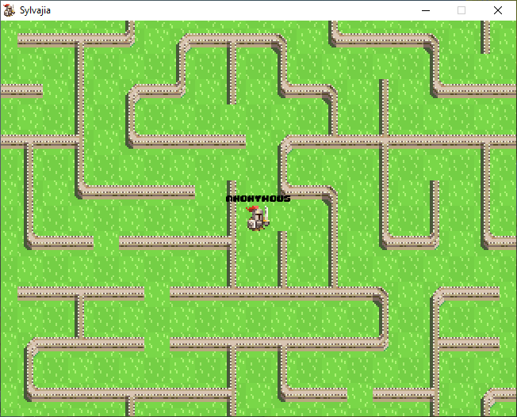

# Sylvajia

Ce projet est un jeu multijoueur en 2D avec une vision verticale. Le personnage évolue sur une grille de cases de terrain.

Le but, dans l'état actuel des choses est de résoudre un labyrinthe. Un labyrinthe parfait aléatoire fait office de monde dans cette version du jeu.

L'affichage du jeu est géré avec la bibliothèque python Pygame, qui permet de créer des jeux facilement avec un système des sprites synchrone simple à prendre en main.

Le multijoueur utilise le SDK de [discord](https://discord.com/) pour fonctionner, et nécessite ainsi l'installation de l'application bureau sur la machine exécutant le jeu.

<details>
    <summary>Table des matières</summary>

- [Sylvajia](#sylvajia)
  - [Cahier des charges](#cahier-des-charges)
    - [Contexte](#contexte)
    - [Objectif](#objectif)
    - [Périmètre](#périmètre)
    - [Ressources](#ressources)
    - [Budget](#budget)
    - [Délais](#délais)
  - [Description fonctionnelle](#description-fonctionnelle)
  - [Fonctionnement général](#fonctionnement-général)
    - [Librairies](#librairies)
    - [Étapes principales du jeu](#étapes-principales-du-jeu)
    - [Gameplay](#gameplay)
    - [Crédits](#crédits)
  - [Structure du programme](#structure-du-programme)
  - [Discord](#discord)
  - [Pygame et moteur de rendu](#pygame-et-moteur-de-rendu)
  - [Le labyrinthe](#le-labyrinthe)
  - [Installation](#installation)
    - [Avec la version compilée](#avec-la-version-compilée)
    - [Avec les sources](#avec-les-sources)
    - [Compiler sa propre version du jeu](#compiler-sa-propre-version-du-jeu)
  - [Aperçu du jeu](#aperçu-du-jeu)
  - [Bilan personnel](#bilan-personnel)
</details>

## Cahier des charges

### Contexte

J'ai créé ce jeu à la demande de mon professeur de NSI afin d'apprendre à faire un produit finit en suivant la demande d'un client.

Ce projet aurait dû être fait en groupe et m'aurait ainsi aidé à développer avec d'autres personnes mais je me suis retrouvé tout seul car le script python m'a désigné pour être tout seul.

### Objectif

Le but de ce projet est d'apprendre à développer un jeu en python, et de résoudre un problème posé par le professeur.

Le jeu doit être divertissant, simple au niveau de la création et de la prise en main.

Il ne doit pas contenir trop de fonctionnalités pour ne pas rendre le projet trop lourd dans le cadre d'un devoir de NSI.

### Périmètre

Le projet doit pouvoir s'adresser au plus d'utilisateurs possible. Le fait qu'il soit codé en python lui permet de tourner sur n'importe quelles machines pour peu qu'elle puisse supporter les dépendances nécessaires (Mac, Linux et Windows).

Il est surtout destiné à mon professeur de NSI.

Le fait qu'il puisse fonctionner en multijoueur permet au jeu d'atteindre un plus grand public et de passer du bon temps avec des amis. Je n'ai pas d'amis donc je n'ai pas pu tester.

### Ressources

Les ressources peuvent se diviser en deux catégories :
- Les ressources matérielles
  * N'importe quel ordinateur fait l'affaire pour peu qu'il puisse faire tourner python, les dépendances nécessaires et un éditeur de code
  * Un peu électricité pour tout faire tourner
- Les ressources numériques
  * Le pack de texture [Toen's Medieval Strategy pack](https://toen.itch.io/toens-medieval-strategy)
  * Pygame pour l'affichage, Pillow pour le traitement des fichiers de textures
  * DiscordSDK et son port pour python pour le multijoueur

La principale limite pour ce projet et la puissance des appareils employés et les limitations des ordinateurs du lycée.

### Budget

Pas de budget j'ai pas d'argent

### Délais

Les délais ont étés repoussés encore et encore mais le projet doit (à l'heure où nous écrivons ces lignes) être rendu avant la deuxième semaine des vacances.

## Description fonctionnelle

Les modules utilisés pour ce projets sont visibles dans la section [Librairies](#librairies).

Le programme doit se découper en différentes parties :
* La section gérant l'affichage du jeu (avec pygame)
* La section gérant la physique du jeu
* La section gérant le multijoueur et la partie sociale du jeu (avec le Discord GameSDK)

## Fonctionnement général

### Librairies

Pour fonctionner correctement et ne pas à avoir à coder le programme octet par octet, ce projet utilise des librairies.

Cela signifie que pour installer le jeu, vous devez utiliser cette commande pour installer les librairies nécessaires : `python -m pip install -r requirements.txt`.

Les librairies utilisées sont les suivantes :

| Nom de la librairie | Utilité |
| :------------------ | :------ |
| [pygame](https://www.pygame.org) | Cette librairie permet d'implémenter facilement l'aspect graphique et sonore du jeu |
| [discordsdk](https://github.com/LennyPhoenix/py-discord-sdk) | Cette librairie est le port sur python du [Discord GameSDK](https://discord.com/developers/docs/game-sdk/sdk-starter-guide) |
| [pillow](https://pillow.readthedocs.io/en/stable/) | Pillow (optionnel pour ce projet, est utilisé lors du développement) permet de modifier facilement des images avec python |


### Étapes principales du jeu
* Démarrage du jeu :
  * Python lance le jeu
  * La librairie Pygame est lancé et la fenêtre s'affiche, avec écrit "Connexion à discord..." en blanc sur noir
  * Le jeu se connecte au client discord pour récupérer le pseudo et l'ID de l'utilisateur. Si discord n'est pas lancé, le jeu se stop est discord est lancé (ceci est géré par la bibliothèque C que discord met à disposition des développeurs)
* Dans le jeu
  * Une fois discord connecté, le jeu s'affiche à l'écran avec le personnage centré sur l'écran dirigeable par les touches de direction. Il est dans un labyrinthe et peut l'explorer. Une sortie est un moulin se trouvent au Sud-Est (en bas à droite) du monde.
* Connexion à une autre partie
  * Le joueur peut inviter ses amis à rejoindre la partie directement dans discord avec un bouton vert affiché au niveau du bouton d'upload. En cliquant dessus, une invitation est envoyée et l'autre utilisateur peut se connecter si son jeu est lancé.
  * Une fois le bouton cliqué, le jeu se connecte au lobby discord (le fonctionnement du SDK est expliqué plus loin), et les joueurs sont connectés sur la même partie. Ils peuvent bouger ensemble et ont le même monde à leur disposition.

### Gameplay
Le gameplay est extrêmement simple : le personnage peut être bougé en utilisant les touches flèches du clavier. Il peut ainsi résoudre le labyrinthe et aller au moulin (allez savoir pourquoi, j'ai pas développé ce jeu...).

### Crédits

Ce projet n'aurait pas été possible sans d'autres projets annexes sur lesquels est basé celui ci, je les remercie donc pour leur travail !
| Nom | Lien | Utilisation | License (si applicable) |
| :-- | :--- | :---------- | :----------------------- |
| Toen's Medieval Strategy Sprite Pack | https://toen.itch.io/toens-medieval-strategy | Basiquement toutes les textures du jeu viennent de ce projet. Aucune texture n'a été modifiée dans l'état actuel des choses. Ce projet est sous licence `Creative Commons v4.0` | http://creativecommons.org/licenses/by/4.0/ |

## Structure du programme
| Dossier | Fichier | Fonction |
| :------ | :------ | :------- |
| [.](https://github.com/ascpial/Sylvajia-NSI) | main.py | Ce script python est celui à utiliser pour lancer le jeu. Il contient les lignes de code nécessaire à la préparation de l'environnement et à l'instanciation de la classe principale |
| [.](https://github.com/ascpial/Sylvajia-NSI) | requirements.txt | Ce fichier contient les modules nécessaires au bon fonctionnement du jeu. Il peut être utilisé avec la commande `py -m pip install -r requirements.txt` |
| [.](https://github.com/ascpial/Sylvajia-NSI) | README.md | Le fichier d'informations que vous lisez actuellement |
| [.](https://github.com/ascpial/Sylvajia-NSI) | .gitignore | Ce fichier est utilisé par le programme de gestion de versions [git](https://git-scm.com) et indique quels fichier ignorer (ici les fichiers ignorés sont les fichiers de configuration de l'IDE populaire [VSCode](https://code.visualstudio.com), le cache de python, et l'environnement virtuel python) |
| [./lib](https://github.com/ascpial/Sylvajia-NSI/tree/main/lib) | * | Ce dossier contient les fichiers binaires nécessaires au GameSDK de discord |
| [./data](https://github.com/ascpial/Sylvajia-NSI/tree/main/data) | * | Ce dossier contient les informations de configuration, de blocs, de texture et de polices pour le jeu |
| [./src](https://github.com/ascpial/Sylvajia-NSI/tree/main/src) | * | Ce dossier contient le code source du jeu |

<details>
    <summary>Voir le contenu du dossier ./data</summary>

| Dossier | Fichier | Fonction |
| :------ | :------ | :------- |
| [./data/images](https://github.com/ascpial/Sylvajia-NSI/tree/main/data/images) | * | Ce dossier contient toutes les textures utilisées par le jeu. |
| [./data/fonts](https://github.com/ascpial/Sylvajia-NSI/tree/main/data/fonts) | * | Ce dossier contient les polices d'écriture utilisées par le jeu |
| [./data/Toen's Medieval Strategy Sprite Pack v.1.0 (16x16)](https://github.com/ascpial/Sylvajia-NSI/tree/main/data/Toen's%20Medieval%20Strategy%20Sprite%20Pack%20v.1.0%20(16x16)) | * | Ce dossier contient les ressources originales du pack de texture, trouvable [ici](https://toen.itch.io/toens-medieval-strategy) |
| [./data](https://github.com/ascpial/Sylvajia-NSI/tree/main/data) | blocs.json | Ce fichier json contient les propriétés des différents terrain disponible dans le jeu. |
| [./data](https://github.com/ascpial/Sylvajia-NSI/tree/main/data) | configuration.json | C'est le fichier de configuration du jeu. Il contient l'ID d'application discord (voir plus dans la section Discord) |
| [./data](https://github.com/ascpial/Sylvajia-NSI/tree/main/data) | textures.json | Ce fichier contient les textures des terrains du jeu, avec notamment les fichiers correspondant, le type de textures (animé ou non...) |
| [./data](https://github.com/ascpial/Sylvajia-NSI/tree/main/data) | networking.png | L'image présentant le fonctionnement de l'interface entre le jeu et l'application discord |
| [./data](https://github.com/ascpial/Sylvajia-NSI/tree/main/data) | Networking.drawio | L'organigramme d'explication du fonctionnement de l'interface entre le jeu et discord ouvrable avec le site [diagrams.net](https://app.diagrams.net) |

</details>

<details>
    <summary>Voir le contenu du dossier ./src</summary>

| Dossier | Fichier | Fonction |
| :------ | :------ | :------- |
| [./src](https://github.com/ascpial/Sylvajia-NSI/tree/main/src) | configuration.py | Ce fichier charge la configuration dans une classe facilement utilisable dans le reste du programme |
| [./src](https://github.com/ascpial/Sylvajia-NSI/tree/main/src) | discord.py | Ce fichier interface discord avec le jeu. Il contient les fonctions appelées aux évènements et implémente le protocole du jeu |
| [./src](https://github.com/ascpial/Sylvajia-NSI/tree/main/src) | enums.py | Certaines section du jeu nécessite d'avoir des nombres utilisés pour certaines tâches. Pour rendre le code plus lisible, ces nombres sont stockés dans ce fichier sous forme de constantes |
| [./src](https://github.com/ascpial/Sylvajia-NSI/tree/main/src) | extract.py | Ce fichier est utilisé pour découper les textures du pack originale en fichiers plus petits et plus faciles d'utilisation |
| [./src](https://github.com/ascpial/Sylvajia-NSI/tree/main/src) | game.py | Ce fichier contient la classe principale du programme. C'est lui qui contient les routines pour répondre aux entrées via le clavier et qui fait marcher les différentes parties du programme ensemble |
| [./src](https://github.com/ascpial/Sylvajia-NSI/tree/main/src) | map.py | Ce fichier contient les classes nécessaires pour gérer le terrain du jeu et la transformation du labyrinthe en terrain jouable |
| [./src](https://github.com/ascpial/Sylvajia-NSI/tree/main/src) | maze_generator.py | Comme son nom l'indique, ce fichier contient le générateur de labyrinthe utilisé pour générer le terrain de la partie, voir la section `Labyrinthe` pour plus d'informations |
| [./src](https://github.com/ascpial/Sylvajia-NSI/tree/main/src) | players.py | Ce fichier contient les classes implémentant les joueurs et la classe permettant de gérer plusieurs joueurs à la fois |
| [./src](https://github.com/ascpial/Sylvajia-NSI/tree/main/src) | payloads.py | Ce fichier permet d'interfacer les différents clients facilement avec une conversion des messages du programmes en messages envoyable via discord |
| [./src](https://github.com/ascpial/Sylvajia-NSI/tree/main/src) | sprites.py | Ce fichier contient les classes qui gèrent les textures et leur affichage sur l'écran |
| [./src](https://github.com/ascpial/Sylvajia-NSI/tree/main/src) | discord_requests.py | Ce fichier est en court de création, il sera utilisé pour faciliter les requêtes entre clients |
| [./src](https://github.com/ascpial/Sylvajia-NSI/tree/main/src) | payloads_workinprogress.py | Comme son nom l'indique, ce fichier est le travail en court pour l'implémentation des payloads en binaire |

</details>

## Discord

> [Discord](https://discord.com)
>> Discord est un logiciel propriétaire gratuit de VoIP et de messagerie instantanée. Il fonctionne sur les systèmes d’exploitation Windows, macOS, Linux, Android, iOS ainsi que sur les navigateurs web.
>
> [Wikipédia](https://wikiepdia.org)

Discord, plateforme de communication initialement dédiée aux communautés de jeux vidéo, inclue de fonctionnalités dans ce sens. En effet, comme on peut le voir dans la [documentation discord](https://discord.com/developers/docs/intro), l'application bureau est munie d'un serveur web destiné à l'implémentation de la plateforme dans le jeu.

Le [Discord GameSDK](https://discord.com/developers/docs/game-sdk/sdk-starter-guide) est un service disponible avec l'application bureau. Il permet aux jeux de se connecter au compte discord du joueur, et de trouver facilement des personnes avec qui jouer. En effet, un système d'invitation pour une partie est disponible dans discord et permet d'envoyer un message contenant un bouton à cliquer qui envois des informations au jeu. Cela peut être exploité pour inviter des gens à rejoindre un monde par exemple.

De plus, le Discord GameSDK permet aussi d'implémenter des fonctionnalités de multijoueur : les utilisateurs peuvent rejoindre des [lobbys](https://discord.com/developers/docs/game-sdk/lobbies) dans lesquels il peuvent partager des informations avec les autres membres en utilisant des métadonnées. Des connections directs entre les utilisateurs pour échanger des données via un système d'évènements est disponible avec l'aspect [networking](https://discord.com/developers/docs/game-sdk/networking) de la librairie, qui permet d'envoyer des messages avec une connexion UDP comme si c'était du TCP très facilement.

Le Discord GameSDK contient aussi d'autres fonctionnalités comme les [achievments](https://discord.com/developers/docs/game-sdk/achievements), les [vocaux](https://discord.com/developers/docs/game-sdk/discord-voice), du [stockage cloud](https://discord.com/developers/docs/game-sdk/storage), des [achats intégrés](https://discord.com/developers/docs/game-sdk/users)...

Pour en savoir plus sur les fonctionnalités disponibles dans le Discord GameSDK, vous pouvez aller voir la [documentation](https://discord.com/developers/docs/game-sdk/sdk-starter-guide).

<details>
    <summary>Étapes de communication avec discord</summary>


</details>

## Pygame et moteur de rendu

L'affichage du jeu est géré par la bibliothèque python [pygame](https://pygame.org/).

> Pygame est une bibliothèque libre multi plate-forme qui facilite le développement de jeux vidéo temps réel avec le langage de programmation Python.
>
> Elle est distribuée selon les termes de la licence GNU LGPL.
>
> Construite sur la bibliothèque SDL, elle permet de programmer la partie multimédia (graphismes, son et entrées au clavier, à la souris ou au joystick), sans se heurter aux difficultés des langages de bas niveaux comme le C et ses dérivés. Cela se fonde sur la supposition que la partie multimédia, souvent la plus contraignante à programmer dans un tel jeu, est suffisamment indépendante de la logique même du jeu pour qu'on puisse utiliser un langage de haut niveau (en l'occurrence le Python) pour la structure du jeu.
>
> Pygame, en plus d'adapter la SDL au Python, fournit également un petit nombre de fonctions spécifiques au développement de jeux.
>
> On peut aussi remarquer que Pygame n'est plus utilisée exclusivement pour des jeux vidéo, mais également pour des applications diverses nécessitant du graphisme.
> [Wikipédia](https://fr.wikipedia.org/wiki/Pygame)

Afin de rendre plus simple l'affichage et la gestion des textures et des tuiles, les classes `Image`, `Sprite` et `Tile` sont disponibles dans le fichiers `./src/sprites.py` et `./src/map.py`.

<details>
    <summary>Étapes principales du jeu</summary>


</details>

## Le labyrinthe

Le labyrinthe est ce qu'on appelle un labyrinthe parfait. Cela veut dire que il y a un et un seul chemin reliant n'importe quel point A à n'importe quel point B. Ce type de labyrinthe se créé facilement aléatoirement.

Le principe est simple et se résume en quelques étapes.

Tout d'abord, il faut créer le labyrinthe avec tout ses murs de manière à ce que chaque case soit séparée de ses voisines par un mur. Le labyrinthe à l'état actuel ressemble à ceci :

```
┌──┬──┬──┬──┬──┐
│  │  │  │  │  │
├──┼──┼──┼──┼──┤
│  │  │  │  │  │
├──┼──┼──┼──┼──┤
│  │  │  │  │  │
└──┴──┴──┴──┴──┘
```

Ensuite, il faut assigner un numéro à chaque cases qui indique à quel zone appartient chaque case :

```
┌──┬──┬──┬──┬──┐
│ 1│ 2│ 3│ 4│ 5│
├──┼──┼──┼──┼──┤
│ 6│ 7│ 8│ 9│10│
├──┼──┼──┼──┼──┤
│11│12│13│14│15│
└──┴──┴──┴──┴──┘
```

On peut maintenant commencer à casser des murs. Pour casser un mur, il faut choisir un mur entre deux zones et le casser. Après avoir cassé le mur il faut fusionner les deux zones voisines au mur en une seule. Pour générer le labyrinthe entier, il faut répéter l'opération jusqu'à ce qu'il n'y ai plus qu'une seule zone.

```
┌──┬──┬──┬──┬──┐    ┌──┬──┬──┬──┬──┐    ┌──┬──┬──┬──┬──┐    ┌─────┬──┬──┬──┐    ┌─────┬──┬──┬──┐    ┌─────┬──┬──┬──┐
│ 1│ 2│ 3│ 4│ 5│    │ 1│ 2│ 3│ 4│ 5│    │ 1│ 2│ 8│ 4│ 5│    │ 1  1│ 8│ 4│ 5│    │ 1  1│ 8│ 4│ 5│    │ 1  1│ 1│ 4│ 5│
├──┼──┼──┼──┼──┤    ├──┼──┼──┴──┼──┤    ├──┼──┤  └──┼──┤    ├──┬──┤  └──┼──┤    ├──┐  │  └──┼──┤    ├──┐  │  └──┼──┤
│ 6│ 7│ 8│ 9│10│ -> │ 6│ 7│ 8  8│10│ -> │ 6│ 7│ 8  8│10│ -> │ 6│ 7│ 8  8│10│ -> │ 6│ 1│ 8  8│10│ -> │ 6│ 1  1  1│10│
├──┼──┼──┼──┼──┤    ├──┼──┼──┬──┼──┤    ├──┼──┼──┬──┼──┤    ├──┼──┼──┬──┼──┤    ├──┼──┼──┬──┼──┤    ├──┼──┬──┬──┼──┤
│11│12│13│14│15│    │11│12│13│14│15│    │11│12│13│14│15│    │11│12│13│14│15│    │11│12│13│14│15│    │11│12│13│14│15│
└──┴──┴──┴──┴──┘    └──┴──┴──┴──┴──┘    └──┴──┴──┴──┴──┘    └──┴──┴──┴──┴──┘    └──┴──┴──┴──┴──┘    └──┴──┴──┴──┴──┘
```

Cette méthode fonctionnes puisque, à chaque mur que l'on détruit, on ne créé qu'un seul nouveau chemin permettant d'aller d'une case de la zone 1 à une case de la zone 2.

L'implémentation de cet algorithme pour le jeu est située dans le fichier `./src/maze_generator.py`.

## Installation

### Avec la version compilée

Le jeu est disponible déjà compilé. Pour pouvoir télécharger le jeu et le lancer facilement sans installer python, vous pouvez suivre ces étapes :
1. Allez sur la [page des releases](https://github.com/ascpial/Sylvajia-NSI/releases)
2. Téléchargez le fichier `Sylvajia_executable.zip` et décompressez le
3. Vous pouvez maintenant lancer le jeu en ouvrant le fichier `Sylvajia.exe` dans le dossier décompressé !

### Avec les sources

Si vous voulez tester le jeu et vous forger votre propre avis, vous pouvez suivre les étapes suivantes :
1. Vérifiez que vous avez bien [python](https://python.org/) 3.9 installé sur votre ordinateur
2. Téléchargez le code source ou clonez le dans un dossier : `git clone https://github.com/ascpial/Sylvajia-NSI`
3. Allez maintenant dans le dossier que vous avez téléchargé / cloné : `cd Sylvajia`
4. Si c'est la première fois que vous installez le jeu, il faut installer les dépendances : `python -m pip install -r requirements.txt`
5. Installez l'application Discord si ce n'est pas fait pour profiter du multijoueur
6. Lancez le jeu dans le terminal en tapant la commande : `python main.py` !

### Compiler sa propre version du jeu

Pour compiler le jeu, si vous voulez pouvoir utiliser une version exécutable du jeu, suivez les étapes suivantes :
1. Si ce n'est pas déjà fait, installez le module `pyinstaller` avec la commande `python -m pip install pyinstaller`
2. Naviguez dans le dossier du code source du jeu dans un terminal
3. Tapez la commande `pyinstaller sylvajia.spec`
4. Une fois créé, le dossier et le fichier .exe à utiliser sont trouvables dans le dossier `./dist` !

## Aperçu du jeu

Voici quelques captures d'écran du jeu pour vous spoiler un peu 😄 :




## Bilan personnel

J'ai beaucoup aimé faire ce projet qui m'a appris beaucoup de choses sur la manière de créer des interfaces graphiques pour un jeu et la manière de traiter les informations de l'utilisateur.

J'ai aussi beaucoup aimé faire la partie concernant discord, même si elle n'a pas grand chose à voir avec le projet demandé par mon professeur.

Enfin, je ne penses pas arrêter le projet à cet endroit mais je vais continuer à développer de jeu pour créer un produit fini encore plus intéressant !